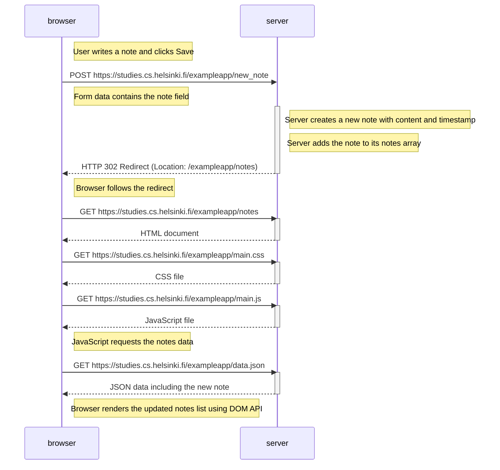

# 0.4: Uusi muistiinpano

```mermaid
sequenceDiagram
    participant browser
    participant server

    Note right of browser: User writes a note and clicks Save

    browser->>server: POST https://studies.cs.helsinki.fi/exampleapp/new_note
    Note right of browser: Form data contains the note field

    activate server
    Note right of server: Server creates a new note with content and timestamp
    Note right of server: Server adds the note to its notes array
    server-->>browser: HTTP 302 Redirect (Location: /exampleapp/notes)
    deactivate server

    Note right of browser: Browser follows the redirect

    browser->>server: GET https://studies.cs.helsinki.fi/exampleapp/notes
    activate server
    server-->>browser: HTML document
    deactivate server

    browser->>server: GET https://studies.cs.helsinki.fi/exampleapp/main.css
    activate server
    server-->>browser: CSS file
    deactivate server

    browser->>server: GET https://studies.cs.helsinki.fi/exampleapp/main.js
    activate server
    server-->>browser: JavaScript file
    deactivate server

    Note right of browser: JavaScript requests the notes data

    browser->>server: GET https://studies.cs.helsinki.fi/exampleapp/data.json
    activate server
    server-->>browser: JSON data including the new note
    deactivate server

    Note right of browser: Browser renders the updated notes list using DOM API
```
